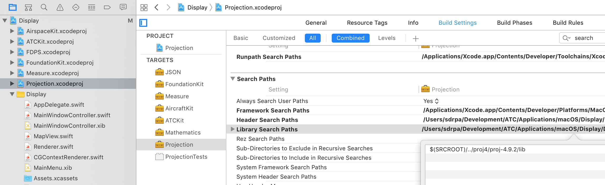

# Display


2D display app using [OATC](http://oatc.io) modules.


# Build Instructions

1. Clone the source repository: ```git clone https://github.com/sdrpa/display-macos.git```
2. Run: ```./prepare``` script inside display-macos directory. 
<small>Prepare script will fetch OATC modules the project depends on and generate xcode project for each module</small>
3. Open ```Display.xcodeproj```.
4. Add ```$(SRCROOT)/../proj4/proj-4.9.2/lib``` to Projection Library Search Paths:

5. Run.

# Contributions

If you would like to contribute, please fork and create a pull request on: [http://github.com/sdrpa/display-macos](http://github.com/sdrpa/display-macos).

# License

Display is licensed under [GPLv3](https://www.gnu.org/licenses/gpl.txt)
