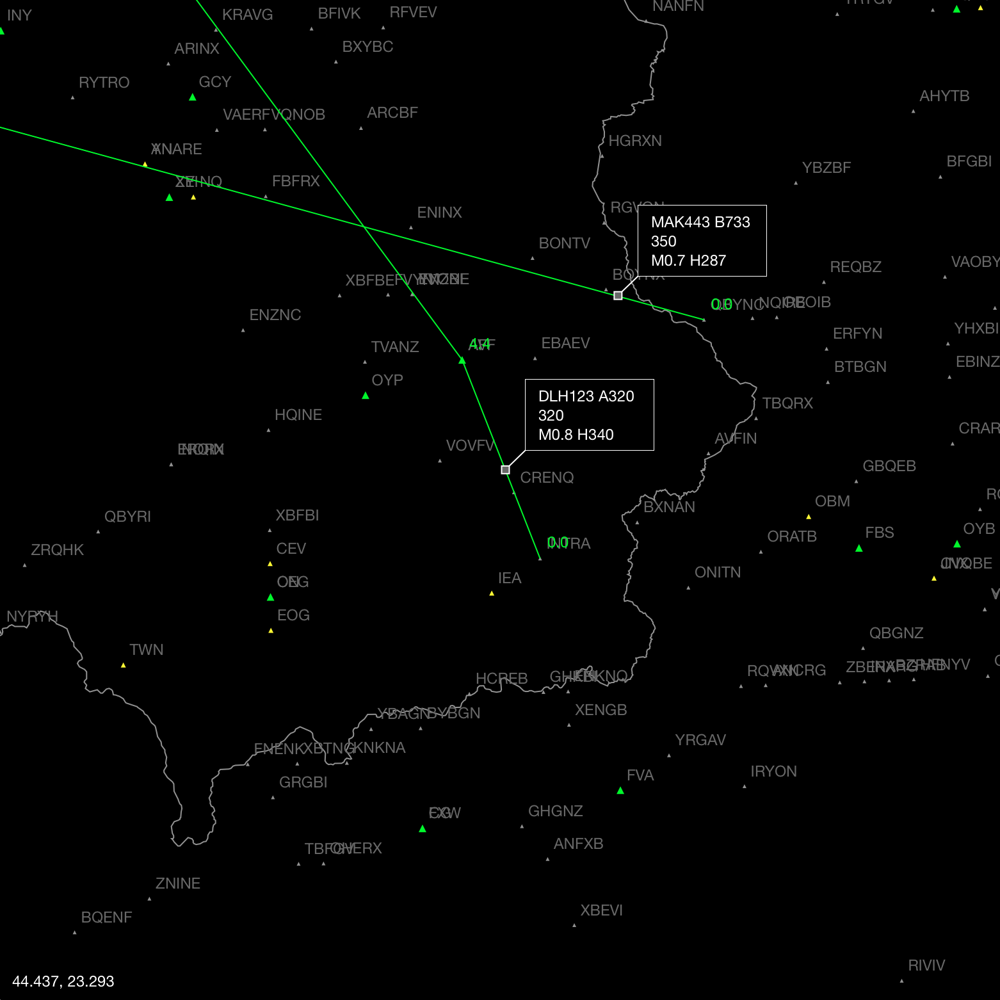

# Display

2D display app using [OATC](http://oatc.io) modules.

# Contributions

If you would like to contribute, please fork and create a pull request on: [http://github.com/sdrpa/display-macos](http://github.com/sdrpa/display-macos).

# License

Display is licensed under [GPLv3](https://www.gnu.org/licenses/gpl.txt)
